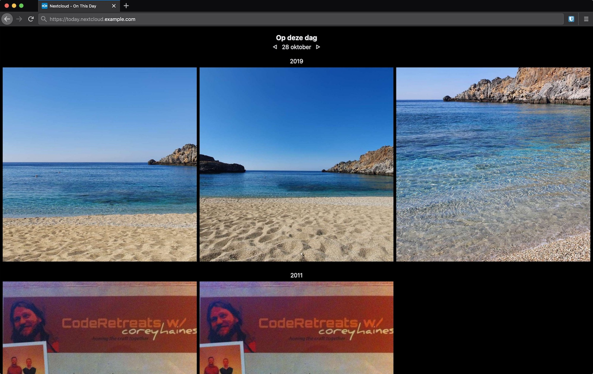

# Nextcloud - On this day

This is a tiny application that provides a photo stream of photos taken on this day in past years,
a la Google Photos "Rediscover this day" and Facebooks "On this day".

Nextcloud doesn't natively support this, [because it doesn't index EXIF data](https://github.com/nextcloud/gallery/issues/51).

This application consists of two parts:

1. An indexer, that indexes your photos based on their EXIF data.
2. A web application, that displays the photo stream.

Both are writting in [Crystal](https://crystal-lang.org).

## Caveats

1. This only works if your photos are stored locally in Nextcloud, not if they're stored in remote storage.
2. This doesn't work with Nextcloud server-side encryption enabled.
3. Only photo's are indexed, not videos.

## Screenshots

